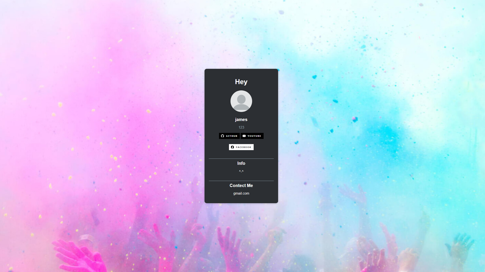
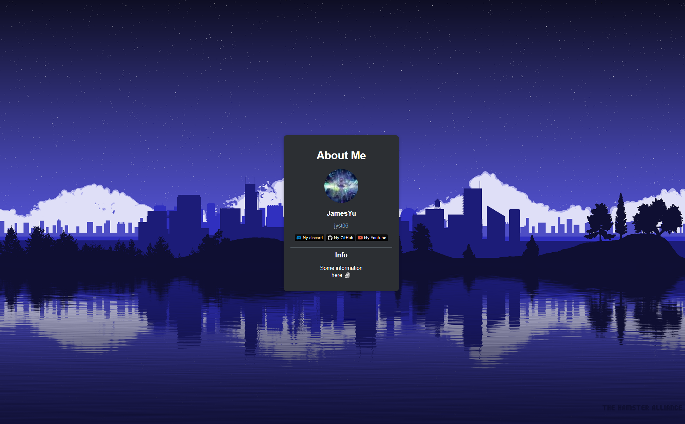

[[English](README.md)|[中文](README_zh.md)]

# Personal Profile Card Module

This module provides a simple way to create a personal profile cards , it can copy user data from various platforms like GitHub, YouTube, and Reddit. It includes customization options such as style, type, theme, and more. You can also use it for advertising your channel on your project.

## Features

- Customize the style of the profile card with predefined styles.
- Set the type of profile card to platforms like GitHub, YouTube, Reddit, or custom.
- Customize the theme to be either light or dark.
- Add badges, background pictures, profile pictures, and more.



```python
from profilecard import Pf

profile = Pf()

profile.set_style(style="2")

profile.set_type(type="custom")

profile.set_name("James &#128511;") #emoji -> &#128511

profile.set_pic("https://i.pinimg.com/564x/40/86/36/40863654e0c78c453f86539d12390405.jpg")

profile.set_theme(theme="light")

profile.set_site_title(title="Introduce")

profile.set_background_pic("https://www.hdwallpapers.in/download/white_wallpaper_5_4k_hd_white-1920x1080.jpg")

profile.add_badge(icon="discord", text="My discord", color="blue", bg_color="gray")
profile.add_badge(icon="github", text="My GitHub", color="white", link="https://github.com/jyst06", bg_color="gray")
profile.add_badge(icon="youtube", text="My Youtube", color="red", bg_color="gray")
profile.add_info("Some information<br>here &#128511;") #emoji -> &#128511

profile.pack()
profile.show()
profile.reset()
```



```python
from profilecard import Pf

profile = Pf()

profile.set_type(type="github", link="https://github.com/jyst06")

profile.set_background_pic("https://wallpapercave.com/wp/wp13902559.png")

profile.add_badge(icon="discord", text="My discord", color="blue", style="flat")
profile.add_badge(icon="github", text="My GitHub", color="white", link="https://github.com/jyst06", style="flat")
profile.add_badge(icon="youtube", text="My Youtube", color="red", style="flat")

profile.add_info("Some information<br>here &#128511;")

profile.pack()
profile.show()
profile.reset()
```


```python
from profilecard import Pf

root = Pf(first=False)
root.set_style("2")
root.set_type(type="custom")
root.add_id("jyst06")
root.set_name("James")
root.set_pic("https://i.pinimg.com/564x/59/dc/8d/59dc8d6797b835e746dd99a2df7dcedd.jpg")

root.add_badge(icon="github", text="GitHub", link="https://github.com/jyst06", bg_color="white", color="black")

root.set_theme("light")
root.add_info("Hello")
root.set_card_title("About Me")
root.set_site_title("my site")
root.add_contect("Nope :(")
root.set_background_pic(r"https://images6.alphacoders.com/133/1330710.png")

root.pack()
root.show()
root.reset()
```

## Pip Installation

To install this module, use the following pip command:

```bash
pip install profilecard
```

## Basic Usage

Here's how you can use the `Pf` class from this module:

```python
from profilecard import Pf

# Create a profile card instance (default is False)
profile = Pf(first=False)

# Change page style (default is style 1)
profile.set_style("2")  # Three styles available: 1, 2, 3

# Set profile type (required)
profile.set_type(type='github', link='https://github.com/yourusername')
profile.set_theme('light')  # Options: light, dark (default is dark)

# Add badges, more icons available on https://simpleicons.org/
profile.add_badge(icon="github", text="GitHub", link="https://github.com/yourusername") 
profile.add_badge(icon="facebook", text="facebook", color="black", bg_color="white")

# Badge arguments: 
# icon (Required) : Choose from 'github', 'youtube', 'facebook', 'twitter', 'instagram', 'reddit', 'gmail' and more...
# style : Choose from 'flat', 'flat-square', 'plastic', 'for-the-badge', 'social' (default: 'for-the-badge')
# color : Default is 'white'
# bg_color : Default is 'black'
# text : Default is None
# link : Default is None

# Add some information
profile.add_info("OwO<br>Hello") #Use <br> as \n , you can also add emoji by searching "HTML emoji code" to get the code

# Add some contact information
profile.add_contect("My mail: abc@gmail.com")

# Set background image
profile.set_background_pic(r"https://storage.pixteller.com/designs/designs-images/2019-03-27/05/simple-background-backgrounds-passion-simple-1-5c9b95c3a34f9.png")

# Change the site title
profile.set_site_title("my site")

# Change profile title
profile.set_card_title("Handsome guy")

# Pack all
profile.pack()

# Display site
profile.show()

# Make sure the config reset to default
profile.reset()
```

## API Reference

The following functions are available in the `Pf` class:

### `help(profilecard)` get the usage in python IDE

---

### `set_style(style: str)`
Sets the style of the profile card.
- **Parameters**:
  - `style`: A string representing the style ('1', '2', '3'). Default is '1'.

---

### `set_type(type: str, link: str)`
Sets the type of profile card and optionally the profile page link.
- **Parameters**:
  - `type`: A string representing the type ('github', 'youtube', 'reddit', 'leetcode', 'custom').
  - `link`: A string representing the link to the profile page.

---

### `set_theme(theme: str)`
Sets the theme of the card.
- **Parameters**:
  - `theme`: A string representing the theme ("light", "dark").

---

### `add_badge(icon: str, style: str, color: str, bg_color: str, text: str, link: str)`
Adds a badge.
- **Parameters**:
  - `icon`: Required. Choose from various icons like 'github', 'youtube', etc.
  - `style`: Badge style, default is 'for-the-badge'.
  - `color`: Color of the text, default is 'white'.
  - `bg_color`: Background color of the badge, default is 'black'.
  - `text`: Text to display on the badge, default is None.
  - `link`: Link to be associated with the badge, default is None.

---

### Additional methods include `set_pic`, `set_name`, `set_background_pic`, `add_info`, `add_contect`, `set_site_title`, `set_card_title`, `pack`, `show`, and `reset`.

---

### Other methods in init file `reset_profilecard_config()`, `show_without_repacking()`

---

## Contributing

Contributions are welcome! Please fork the repository and open a pull request with your changes.

## License

This project is licensed under the MIT License - see the [LICENSE](LICENSE.md) file for details.

